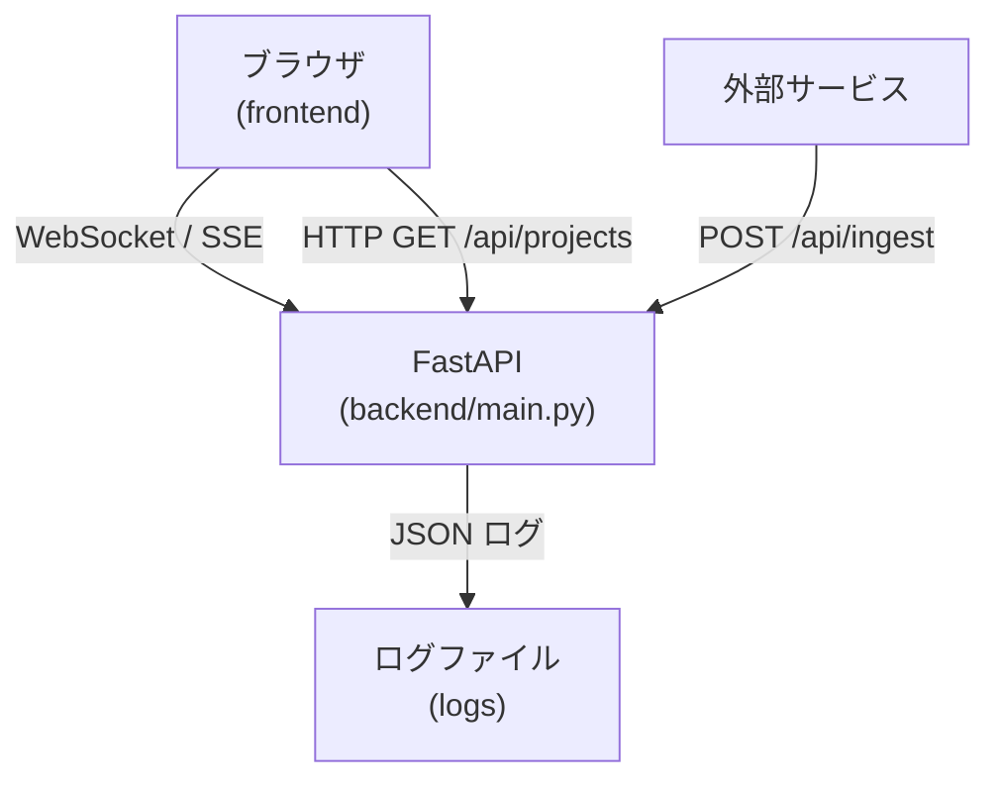

# VibeLogger Dashboard

> [!NOTE]
> このプロジェクトは[vibe coding](https://ja.wikipedia.org/wiki/%E3%83%90%E3%82%A4%E3%83%96%E3%82%B3%E3%83%BC%E3%83%87%E3%82%A3%E3%83%B3%E3%82%B0)で作成しました。

リアルタイムに JSON ログを可視化し、WebSocket / SSE でストリーミング配信するダッシュボードです。FastAPI と VibeCoding Logger によるサンプル実装で、開発・運用現場でのモニタリングの雛形として活用できます。

<!-- START doctoc generated TOC please keep comment here to allow auto update -->
<!-- DON'T EDIT THIS SECTION, INSTEAD RE-RUN doctoc TO UPDATE -->
- [概要](#概要)
- [主な機能](#主な機能)
- [システム構成図](#システム構成図)
- [動作要件](#動作要件)
- [インストール](#インストール)
- [クイックスタート](#クイックスタート)
- [設定](#設定)
- [API](#api)
- [リアルタイム配信 (WS / SSE)](#リアルタイム配信-ws--sse)
- [データモデル](#データモデル)
- [カスタマイズ](#カスタマイズ)
- [トラブルシューティング](#トラブルシューティング)
- [ライセンス](#ライセンス)
- [謝辞](#謝辞)
<!-- END doctoc generated TOC please keep comment here to allow auto update -->

## 概要

VibeLogger Dashboard は、複数プロジェクトから生成される JSON 形式のログを集中管理し、リアルタイムでブラウザに配信する軽量ダッシュボードです。バックエンドは FastAPI、フロントエンドはバニラ JS + HTML で構成され、依存関係を極力抑えています。

## 主な機能

- 📡 **リアルタイムストリーミング**: WebSocket / Server-Sent Events でログを即時配信
- 🗂 **プロジェクト分割**: プロジェクトごとのログディレクトリ自動生成
- 📝 **ダミーログ生成**: デモ用のログを自動で生成（開発モード）
- 🔌 **外部連携**: `POST /api/ingest` で外部サービスから簡単にログ取り込み
- ♻️ **ホットリロード**: 開発モードではコード変更を自動検知
- 💾 **ファイル保存**: ログをローテーション付きファイルとして保存

## システム構成図



## 動作要件

| ソフトウェア | バージョン | 備考 |
|-------------|-----------|------|
| Python      | 3.11 以上 | `uv` での実行を推奨 |
| uv          | latest    | <https://github.com/astral-sh/uv> |
| Node.js     | 任意      | フロントエンドを改修する場合のみ |

## インストール

```bash
# 1. リポジトリを取得
$ git clone https://github.com/smorce/vibeLogger_dashboard.git
$ cd vibeLogger_dashboard

# 2. 仮想環境を作成
$ uv venv

# 3. 依存関係をインストール
$ uv pip install -r requirements.txt
```

## クイックスタート

### 1. ダミーログあり（開発用）
```bash
uv run vibeLogger_dashboard/backend/main.py
```

### 2. ダミーログなし（本番・テスト用）
```bash
uv run vibeLogger_dashboard/backend/main.py --no-dummy
```

#### 2-1. 外部からログ送信
```bash
uv run vibeLogger_dashboard/tests/send_test_log.py
```

### 3. テストモード（ログ生成のみ）
```bash
uv run vibeLogger_dashboard/backend/main.py test
```

### 4. ヘルプ
```bash
uv run vibeLogger_dashboard/backend/main.py --help
```

起動後、以下の URL にアクセスしてください。

- メインページ: <http://127.0.0.1:6702>
- API ドキュメント (Swagger UI): <http://127.0.0.1:6702/docs>
- WebSocket: `ws://127.0.0.1:6702/ws`
- Server-Sent Events: <http://127.0.0.1:6702/sse>

## 設定

| 種別 | オプション / 変数 | 既定値 | 説明 |
|------|------------------|-------|------|
| CLI  | `--no-dummy`     | false | ダミーログ生成を無効化 |
| CLI  | `mode`           | server| `test` = ログ生成のみ |
| CLI  | `--port`         | 6702  | サーバーのリッスンポート |
| ENV  | `LOG_DIR`        | `logs` | ログ保存先ディレクトリ |

## API

### GET `/api/projects`
プロジェクト一覧と保有するログファイルを JSON で返します。

### POST `/api/ingest`
外部サービスが JSON 形式のログを送信するためのエンドポイント。

リクエスト例:
```bash
curl -X POST http://127.0.0.1:6702/api/ingest \
     -H "Content-Type: application/json" \
     -d '{
           "level": "INFO",
           "operation": "build",
           "message": "build finished",
           "project": "ci_pipeline"
         }'
```
tests/send_test_log.py も参考にしてください。

## リアルタイム配信 (WS / SSE)

| プロトコル | エンドポイント | 使用例 |
|------------|---------------|-------|
| WebSocket  | `ws://127.0.0.1:6702/ws` | JavaScript による接続例:
```js
const ws = new WebSocket("ws://127.0.0.1:6702/ws");
ws.onmessage = e => console.log(JSON.parse(e.data));
```
| SSE        | `http://127.0.0.1:6702/sse` | curl 例: `curl -N http://127.0.0.1:6702/sse` |

## データモデル

`LogEntry` オブジェクトは以下のような JSON として配信されます。

```json
{
  "timestamp": "2025-07-11T08:44:08.918671+00:00",
  "level": "INFO",
  "correlation_id": "bf92f353-69a8-43a8-bbff-1a81029057b2",
  "operation": "data_processing",
  "message": "data_processing started",
  "context": {"user": "Alice", "status": "started"},
  "environment": {
    "python_version": "3.11.13 (main, Jun  4 2025, 08:57:29) [GCC 11.4.0]",
    "os": "Linux",
    "platform": "Linux-6.1.123+-x86_64-with-glibc2.35",
    "architecture": "x86_64"
  },
  "source": "ipython-input-5-741350432.py:97 in generate_logs_for_test()",
  "stack_trace": null,
  "human_note": "AI: Monitor data_processing completion for user Alice",
  "ai_todo": null
}
```

### フィールド解説
- `timestamp`: ISO8601 形式のタイムスタンプ (UTC)
- `level`: ログレベル (`INFO`, `WARNING`, `ERROR`, `DEBUG`, `SUCCESS`)
- `correlation_id`: リクエスト単位の相関 ID
- `operation`: 操作名 / 処理名
- `message`: 人間向けメッセージ
- `context`: 任意の追加メタデータ (JSON)
- `environment`: 実行環境メタデータ
- `source`: 呼び出し元ファイル・行番号
- `stack_trace`: 例外発生時のスタックトレース
- `human_note`: 人間が付与したメモ
- `ai_todo`: AI が提案する TODO

## カスタマイズ

1. **UI 変更**: `vibeLogger_dashboard/frontend/` 配下の `index.html`, `script.js`, `style.css` を編集。
2. **ログ構造拡張**: `LogEntry` 生成部分 (`backend/main.py` 内のロガー) で追加フィールドを付与。
3. **ポート変更**: `--port` 引数で起動時に指定。
4. **ダミーログ頻度**: `generate_logs()` 内の `await asyncio.sleep()` 間隔を変更。

## トラブルシューティング

| 症状 | 原因 | 対処 |
|------|------|------|
| `User code passed in but reload=True` 警告 | `uvicorn` にオブジェクト `app` を渡すと `--reload` と衝突 | **エラーの原因** 節を参照し、`--no-dummy` かインポート文字列を使用 |
| ブラウザにログが表示されない | WebSocket / SSE 接続エラー | ブラウザコンソールでネットワークエラーを確認し、ポート・エンドポイントを再確認 |
| `ModuleNotFoundError: vibelogger` | vibelogger パッケージ未インストール | `uv pip install vibelogger` またはモック実装を利用 |

### エラーの原因

`uvicorn` は `--reload`（または `reload=True`）を有効にして実行する場合、アプリケーションを **インポート文字列**（例: `"main:app"`）として渡す必要があります。これにより、コード変更時にモジュールを正しく再読み込みできます。

本プロジェクトでは `--no-dummy` フラグを使ってダミーログを停止する際に、`reload=False` で起動しアプリケーションオブジェクト (`app`) を直接渡すことでフラグ状態を維持しています。

| シナリオ | `uvicorn.run(...)` の渡し方 | `reload` 値 |
|----------|-----------------------------|-------------|
| ダミーログあり（開発） | `"backend.main:app"` | `True` |
| ダミーログなし（本番/テスト） | `app` | `False` |

## ライセンス

VibeCoding Logger を踏襲して、このプロジェクトは MIT ライセンスの下で公開されています。詳細は [LICENSE](LICENSE) ファイルをご確認ください。

## 謝辞

このプロジェクトは[VibeCoding Logger](https://github.com/fladdict/vibe-logger)プロジェクトを利用させていただきました。